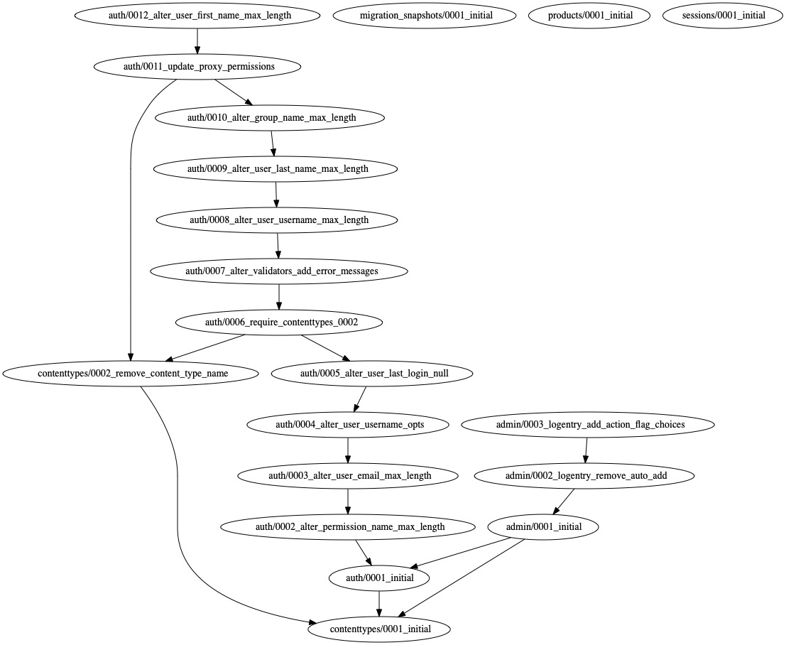

=============================
Django Migration Snapshots
=============================

.. image:: https://img.shields.io/pypi/v/django-migration-snapshots.svg?style=for-the-badge
   :target: https://pypi.org/project/django-migration-snapshots/

.. image:: https://img.shields.io/pypi/pyversions/django-migration-snapshots?style=for-the-badge
   :target: https://pypi.org/project/django-migration-snapshots/

.. image:: https://img.shields.io/badge/code%20style-black-000000.svg?style=for-the-badge
   :target: https://github.com/psf/black

Capture django migration history snapshots

Documentation
-------------

The full documentation is at https://django-migration-snapshots.readthedocs.io.

Quickstart
----------

Install Django Migration Snapshots::

    pip install django-migration-snapshots

Add it to your `INSTALLED_APPS`:

.. code-block:: python

    INSTALLED_APPS = (
        ...
        "migration_snapshots",
        ...
    )

Execute management command to create snapshot::

    python manage.py create_snapshot

**OR**

Create ``MigrationSnapshot`` object programmatically or from the admin panel::

    MigrationSnapshot.objects.create(output_format="pdf")

Text Snapshot
^^^^^^^^^^^^^^^^^^

.. code-block:: python

    digraph {
        "admin/0001_initial" -> "auth/0001_initial"
        "admin/0001_initial" -> "contenttypes/0001_initial"
        "admin/0002_logentry_remove_auto_add" -> "admin/0001_initial"
        "admin/0003_logentry_add_action_flag_choices" -> "admin/0002_logentry_remove_auto_add"
        "auth/0001_initial" -> "contenttypes/0001_initial"
        "auth/0002_alter_permission_name_max_length" -> "auth/0001_initial"
        ...
    }

Graphical Snapshot
^^^^^^^^^^^^^^^^^^

Features
--------
* ``MigrationSnapshot`` data model
* Supported output formats

  * *BMP, CGIMAGE, DOT_CANON, DOT, GV, XDOT, XDOT12, XDOT14, EPS, EXR, FIG, GD, GIF, GTK, ICO, CMAP, ISMAP, IMAP, CMAPX, IMAGE_NP, CMAPX_NP, JPG, JPEG, JPE, JPEG_2000, JSON, JSON0, DOT_JSON, XDOT_JSON, PDF, PIC, PICT, APPLE_PICT, PLAIN_TEXT, PLAIN_EXT, PNG, POV_RAY, PS_PDF, PSD, SGI, SVG, SVGZ, TGA, TIF, TIFF, TK, VML, VMLZ, VRML, WBMP, WEBP, XLIB, X11*

Testing
-------
* TODO

Development commands
---------------------

::

    make install
    make build
    make deploy
